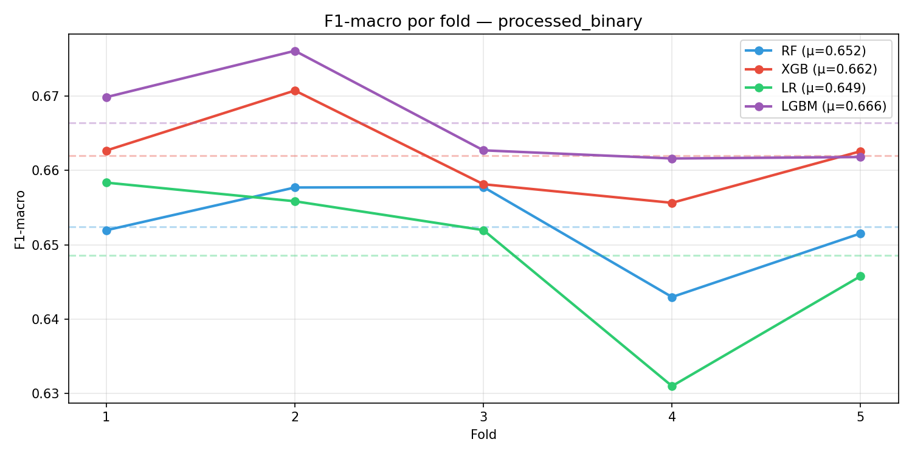
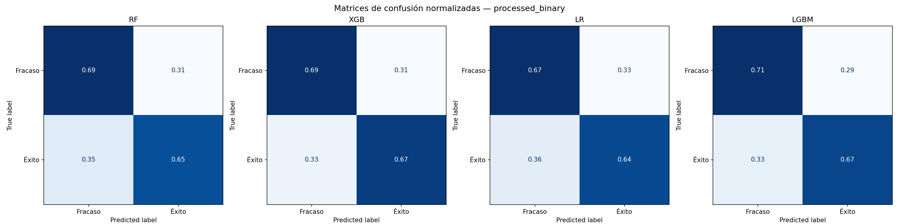
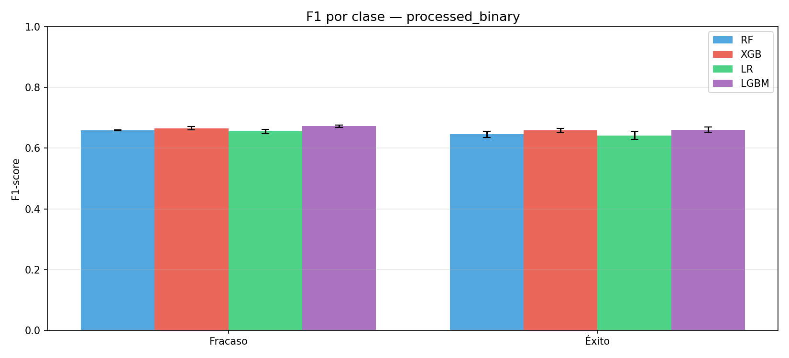
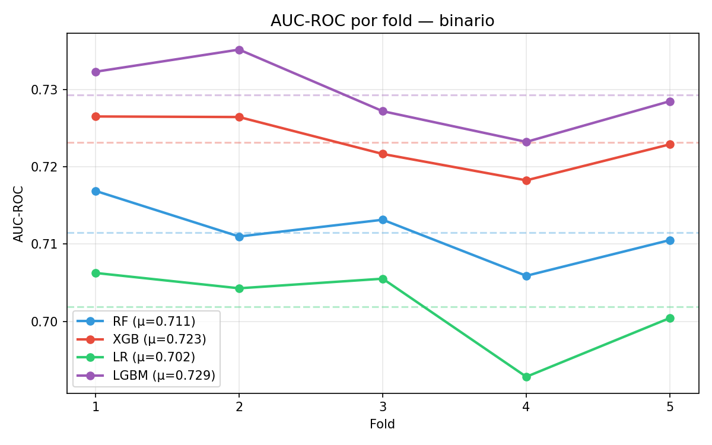
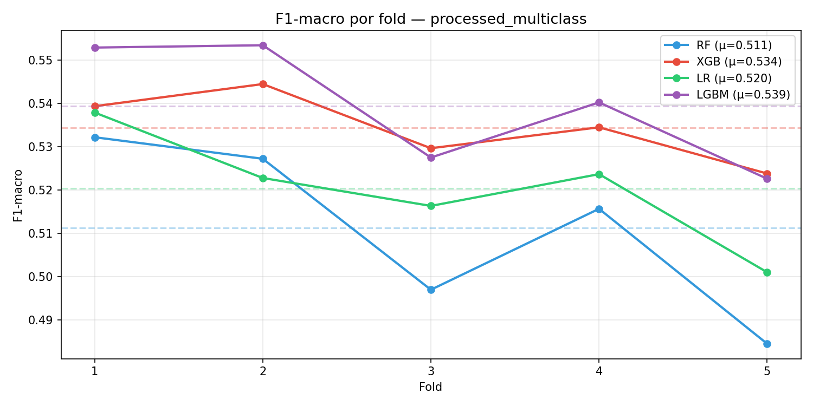
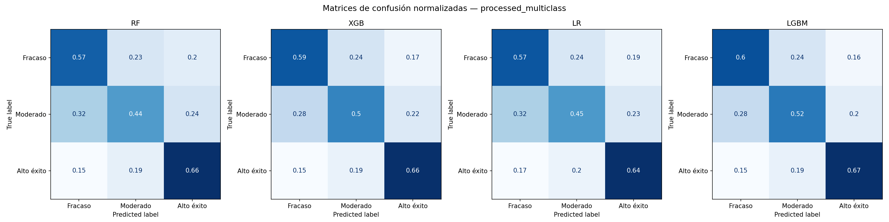
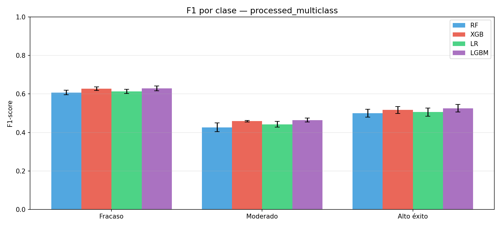

# 🎮 AI Videogame Success Predictor

> **Predict the commercial success of an indie game on Steam *before* it launches — using only information available at design time.**

---

## What is this?

AI Videogame Success Predictor is a machine-learning pipeline that ingests pre-launch game metadata (genre, tags, price, platform support, localization, store presence...) and outputs a commercial viability verdict: **Failure**, **Moderate Success**, or **High Success** on Steam.

The system was trained on a dataset of **75,000+ real Steam games** (Kaggle) and filtered down to **13,105 verified indie titles** with significant review volume, eliminating AAA outliers that would distort the model. Two independent prediction modes are available depending on the analytical depth required.

**Key differentiator:** the model is trained *exclusively on pre-launch signals* — it does not cheat by reading post-launch metrics like review scores or player counts. Everything it knows at inference time is what a developer would know the day before release.

---

## Use Cases

| Persona | Application |
|---|---|
| **Indie Studio / Publisher** | Evaluate commercial potential of a game in early design, before committing production budget |
| **Venture Capital / Gaming Fund** | Screen investment proposals with a data-driven viability score |
| **Product Manager** | Benchmark a planned title against 13,000+ historical releases |
| **Academic / Researcher** | Study what pre-launch signals correlate with indie commercial success |
| **Game Jam Organizer** | Score or rank submitted projects with a transparent methodology |

---

## Project Structure

```
AI-VideogameSuccessPredictor/
├── 00_eda.py                      → Exploratory data analysis, generates EDA plots
├── 01_preprocess.py               → General preprocessing (legacy)
├── 01_preprocess_binary.py        → Binary pipeline: Failure vs Success
├── 01_preprocess_multiclass.py    → 3-class pipeline: Failure / Moderate / High Success
├── 02_train_RF.py                 → Random Forest training
├── 02.1_train_XGB.py              → XGBoost training
├── 02.2_train_LR.py               → Logistic Regression training
├── 02.3_train_LGBM.py             → LightGBM training (production model)
├── 02.4_compare_ALL.py            → Cross-model benchmark and chart generation
├── 03_predict.py                  → CLI predictor — interactive or JSON input
├── examples/
│   ├── my_game.json               → Example: cozy indie adventure
│   └── survival_horror_game.json  → Example: atmospheric horror title
├── data/
│   ├── games.csv                  ← Raw Steam dataset (Kaggle, ~75k games)
│   ├── processed_binary.parquet   → Preprocessed binary dataset
│   └── processed_multiclass.parquet → Preprocessed 3-class dataset
├── models/
│   ├── processed_binary/          → Trained pipelines + metadata (binary)
│   └── processed_multiclass/      → Trained pipelines + metadata (3-class)
├── outputs/
│   ├── processed_binary/          → Comparison charts (binary)
│   └── processed_multiclass/      → Comparison charts (3-class)
└── requirements.txt
```

---

## Dataset

The raw dataset is the [Steam Games Dataset by Nik Artermiloff](https://www.kaggle.com/datasets/artermiloff/steam-games-dataset) from Kaggle, containing **47 columns** across 75,000+ Steam titles.

### Sample raw records (full dataset)

| Name | Price | Estimated Owners | Genres | Peak CCU | % Positive | Total Reviews |
|---|---|---|---|---|---|---|
| Terraria | $9.99 | 20M – 50M | Action, Adventure, Indie, RPG | 30,516 | 98% | 1,379,233 |
| Stardew Valley | $14.99 | 20M – 50M | Indie, RPG, Simulation | 67,309 | 98% | 854,853 |
| Phasmophobia | $19.99 | 10M – 20M | Action, Indie, Early Access | 20,766 | 96% | 754,960 |
| Ready or Not | $49.99 | 2M – 5M | Action, Adventure, Indie | 6,837 | 89% | 176,759 |
| Darkest Dungeon | $24.99 | 2M – 5M | Indie, RPG, Strategy | 4,933 | 91% | 127,426 |
| Subnautica | $29.99 | 2M – 5M | Adventure, Indie | 5,090 | 97% | 276,935 |

### After preprocessing filters (training set)

| Filter | Records removed | Reason |
|---|---|---|
| Non-indie games | ~62,000 | Focus on the independently-published segment |
| < 100 total reviews | ~8,000 | Insufficient signal, high noise |
| estimated_owners > 5M | ~200 | Megahit outliers break score normalization |
| Missing peak_ccu / tags | ~1,500 | Incomplete records |
| **Final training set** | **13,105** | Clean, balanced indie titles |

---

## Success Score Formula

The target variable is computed from **post-launch metrics that are explicitly excluded at inference time** — the model never sees these during prediction. They are only used to label historical training data.

```
success_score =
  0.40 × estimated_owners_norm    (market reach)
+ 0.25 × peak_ccu_norm            (concurrent player peak)
+ 0.20 × total_reviews_norm       (community engagement)
+ 0.10 × pct_positive_norm        (sentiment quality)
+ 0.05 × metacritic_score_norm    (press reception, binary mode only)
```

All components are normalized per-percentile (P1–P99) to prevent extreme outliers from dominating the scale.

### Class boundaries

| Score Range | Binary Mode | Multiclass Mode |
|---|---|---|
| 0 – 50 | 🔴 **Fracaso** (Failure) | 🔴 **Fracaso** |
| 50 – 100 | 🟢 **Éxito** (Success) | 🟡 **Moderado** (score 50–70) / 🟢 **Alto Éxito** (score 70–100) |

> The binary split uses the median (P50) to enforce a perfectly balanced 50/50 training distribution, mitigating class imbalance issues without resampling.

### Real examples by class

| Game | success_score | Class (Multiclass) |
|---|---|---|
| Mirror 2: Project X | ~12 | 🔴 Fracaso (24% positive, Early Access) |
| Kerbal Space Program 2 | ~18 | 🔴 Fracaso (31% positive, controversial launch) |
| Cube World | ~31 | 🔴 Fracaso (43% positive, abandoned development) |
| American Truck Simulator | ~74 | 🟢 Alto Éxito (97% positive, 2M+ owners) |
| Darkest Dungeon | ~71 | 🟢 Alto Éxito (91% positive, niche cult hit) |
| MiSide | ~68 | 🟡 Moderado (98% positive but ~150K owners) |

---

## Input Features (Pre-Launch Only)

These are the **60 features** the model receives at prediction time — all available before a game ships:

### Numeric & Boolean Features

| Feature | Type | Description |
|---|---|---|
| `price` | float | Sale price in USD (0.0 = Free-to-Play) |
| `is_free` | binary | 1 if price == 0 |
| `required_age` | int | Age gate: 0, 7, 12, 16, or 18 |
| `plat_windows` | binary | Windows support |
| `plat_mac` | binary | macOS support |
| `plat_linux` | binary | Linux/SteamOS support |
| `n_platforms` | int | Sum of platform flags (1–3) |
| `is_multiplayer` | binary | Has multiplayer or co-op |
| `mp_x_free` | binary | Interaction: free × multiplayer (strong market signal) |
| `languages_market_score` | float | Weighted localization index (see below) |
| `n_screenshots` | int | Store page screenshots (capped at P95) |
| `n_movies` | int | Trailers on store page (capped at P95) |
| `n_achievements` | int | Steam achievements (capped at P95) |
| `release_quarter` | int | Launch quarter 1–4 (seasonality proxy) |
| `publisher_success_avg` | float | Historical avg success score of the publisher |

### Language Market Score

Instead of a simple language count, the model uses a **region-weighted market index** that reflects Steam's actual geographic revenue distribution:

| Language | Weight | Language | Weight |
|---|---|---|---|
| English | 1.00 | Japanese | 0.30 |
| Simplified Chinese | 0.85 | Korean | 0.28 |
| Russian | 0.55 | Polish | 0.22 |
| German | 0.45 | Turkish | 0.20 |
| French | 0.40 | Traditional Chinese | 0.18 |
| Spanish – Spain | 0.35 | Italian | 0.17 |
| Portuguese – Brazil | 0.33 | Arabic | 0.07 |

> A game with English + Spanish – Spain + German scores 1.00 + 0.35 + 0.45 = **1.80**. A game with English + 10 minor languages may score less due to the diminishing-return weighting structure.

### Genre Features (One-Hot, Top 14)

`genre_indie`, `genre_casual`, `genre_action`, `genre_adventure`, `genre_simulation`, `genre_strategy`, `genre_rpg`, `genre_early_access`, `genre_free_to_play`, `genre_sports`, `genre_racing`, `genre_massively_multiplayer`, `genre_violent`, `genre_gore`

### Tag Features (One-Hot, Top 30)

`tag_singleplayer`, `tag_action`, `tag_adventure`, `tag_casual`, `tag_2d`, `tag_puzzle`, `tag_strategy`, `tag_simulation`, `tag_3d`, `tag_atmospheric`, `tag_rpg`, `tag_pixel_graphics`, `tag_colorful`, `tag_exploration`, `tag_story_rich`, `tag_cute`, `tag_arcade`, `tag_first_person`, `tag_early_access`, `tag_fantasy`, `tag_horror`, `tag_funny`, `tag_platformer`, `tag_retro`, `tag_action_adventure`, `tag_relaxing`, `tag_family_friendly`, `tag_shooter`, `tag_multiplayer`

---

## Models & Performance

Four models were trained and benchmarked via **5-fold stratified cross-validation** on the same preprocessed datasets.

### Binary Mode (Failure vs Success)

| Model | F1 Macro (CV mean) | F1 Macro (std) | AUC-ROC |
|---|---|---|---|
| **LightGBM** ⭐ | **0.667** | ±0.008 | **0.732** |
| XGBoost | 0.662 | ±0.005 | 0.723 |
| Random Forest | 0.652 | ±0.005 | 0.711 |
| Logistic Regression | 0.649 | ±0.010 | 0.702 |

### Multiclass Mode (Failure / Moderate / High Success)

| Model | F1 Macro (CV mean) | F1 Macro (std) |
|---|---|---|
| **LightGBM** ⭐ | **0.547** | ±0.012 |
| XGBoost | ~0.533 | — |
| Random Forest | ~0.521 | — |
| Logistic Regression | ~0.514 | — |

> LightGBM is used as the production model for both modes. All pipelines include StandardScaler for numeric features. Models are serialized as `.joblib` pipelines for portable, dependency-aware inference.

### LightGBM Hyperparameters (Production)

| Parameter | Value | Rationale |
|---|---|---|
| `n_estimators` | 800 | High tree count for stable ensembling |
| `max_depth` | 4 | Prevents overfitting on 13K samples |
| `learning_rate` | 0.03 | Conservative shrinkage |
| `subsample` | 0.7 | Row subsampling per tree |
| `colsample_bytree` | 0.7 | Feature subsampling per tree |
| `min_child_samples` | 20 | Minimum leaf population |
| `reg_alpha` | 0.1 | L1 regularization |
| `reg_lambda` | 10.0 | Strong L2 — key anti-overfit lever |
| `class_weight` | balanced | Compensates residual class imbalance |
| `random_state` | 42 | Reproducibility |

---

## Benchmark Charts

### Binary Mode — F1 per Fold (5-Fold CV)



*Each bar represents the macro-F1 score of a model across one fold. LightGBM consistently tops or ties the benchmark across all 5 splits, with lower variance than Logistic Regression.*

### Binary Mode — Normalized Confusion Matrix



*Diagonal values represent correctly classified samples. LightGBM achieves the most balanced distribution, avoiding systematic bias toward either class.*

### Binary Mode — F1 per Class



*Breakdown by Failure (class 0) and Success (class 1). All tree-based models outperform Logistic Regression on the minority patterns, particularly the high-success signal.*

### Binary Mode — AUC per Fold



*ROC-AUC scores per fold. LightGBM maintains an average AUC of 0.732, meaning it correctly ranks a successful game above a failing one in ~73% of pairwise comparisons — without any post-launch data.*

### Multiclass Mode — F1 per Fold



*3-class prediction is harder (F1 ~0.55 vs ~0.67 for binary). The drop is expected: distinguishing "Moderate" from "High Success" is genuinely ambiguous even for human analysts.*

### Multiclass Mode — Normalized Confusion Matrix



*The most common confusion is between Moderate and High Success — the boundary classes. Failure is the most reliably identified category across all models.*

### Multiclass Mode — F1 per Class



*Fracaso is the strongest class for every model. The Moderado class is hardest to predict correctly, which is consistent with its position as the boundary between the extremes.*

---

## Installation

```bash
git clone <repository-url>
cd AI-VideogameSuccessPredictor
pip install -r requirements.txt
```

### Requirements

```
pandas>=2.0
numpy>=1.24
scikit-learn>=1.4
matplotlib>=3.7
joblib>=1.3
pyarrow>=14.0
fastparquet
lightgbm
xgboost
```

> Models are already trained and saved in `models/`. You do **not** need to retrain to run predictions.

---

## Usage

### Step 1 — (Optional) Exploratory Analysis

```bash
python 00_eda.py
```
Generates distribution plots of target variables in `outputs/eda_*.png`.

### Step 2 — Preprocessing

```bash
# Binary classification (Failure vs Success)
python 01_preprocess_binary.py

# 3-class classification (Failure / Moderate / High Success)
python 01_preprocess_multiclass.py
```
Outputs: `data/processed_binary.parquet`, `data/processed_multiclass.parquet`, and `models/thresholds_*.json`.

### Step 3 — Train Models

```bash
python 02_train_RF.py          # Random Forest
python 02.1_train_XGB.py       # XGBoost
python 02.2_train_LR.py        # Logistic Regression
python 02.3_train_LGBM.py      # LightGBM (production model)
python 02.4_compare_ALL.py --data processed_binary      # Full benchmark + charts
python 02.4_compare_ALL.py --data processed_multiclass
```

### Step 4 — Predict

**Interactive CLI:**
```bash
python 03_predict.py
```

The CLI will ask for prediction mode (binary or multiclass), then guide you through each parameter interactively.

**JSON file input:**
```bash
python 03_predict.py --json examples/my_game.json
python 03_predict.py --json examples/survival_horror_game.json
```

---

## Examples

### Example 1 — `my_game.json`: Hare&Shell

A cozy indie adventure game with minimal localization and basic store presence.

```json
{
  "name": "Hare&Shell",
  "price": 4.99,
  "required_age": 0,
  "supported_languages": ["English", "Spanish - Spain"],
  "multiplayer": false,
  "windows": true,
  "mac": false,
  "linux": false,
  "n_screenshots": 5,
  "n_movies": 1,
  "n_achievements": 10,
  "genres": ["Indie", "Adventure"],
  "tags": ["Singleplayer", "Fantasy", "Open World"],
  "publisher": "Other",
  "description": "A cozy indie open world set in a cursed island with funny characters.",
  "release_year": 2026,
  "release_quarter": 3
}
```

**Expected output (Binary Mode):**
```
════════════════════════════════════════════════════════════
 📊  INFORME PREDICTIVO INDIE: HARE&SHELL
════════════════════════════════════════════════════════════
  VERDICTO FINAL:  🔴 FRACASO (Fracaso)

  Desglose de probabilidad estadística:
    🔴 FRACASO      (Fracaso   )  [████████████░░░░░░░░░░░░░░░░░░]  41.2%
    🟢 ÉXITO        (Éxito     )  [██████████████████░░░░░░░░░░░░]  58.8%
════════════════════════════════════════════════════════════
```

*Analysis: Low price point ($4.99), only 2 languages, sparse store media (5 screenshots, 1 trailer), and no multiplayer. The "Open World" tag and self-publishing history slightly improve odds, but the model rates it borderline — real outcome would depend heavily on marketing execution.*

---

### Example 2 — `survival_horror_game.json`: Echoes of Dread

A first-person psychological horror game with strong localization and richer store presence.

```json
{
  "name": "Echoes of Dread",
  "price": 12.99,
  "required_age": 18,
  "supported_languages": ["English", "German", "French", "Spanish - Spain",
                          "Portuguese - Brazil", "Russian"],
  "multiplayer": false,
  "windows": true,
  "mac": false,
  "linux": true,
  "n_screenshots": 10,
  "n_movies": 2,
  "n_achievements": 25,
  "genres": ["Indie", "Action", "Adventure"],
  "tags": ["Horror", "Singleplayer", "Atmospheric", "Story Rich", "Exploration",
           "3D", "First Person"],
  "publisher": "Other",
  "description": "A first-person psychological horror set in an abandoned research facility.",
  "release_year": 2026,
  "release_quarter": 4
}
```

**Expected output (Multiclass Mode):**
```
════════════════════════════════════════════════════════════
 📊  INFORME PREDICTIVO INDIE: ECHOES OF DREAD
════════════════════════════════════════════════════════════
  VERDICTO FINAL:  🟡 MODERADO (Moderado)

  Desglose de probabilidad estadística:
    🔴 FRACASO      (Fracaso   )  [████████░░░░░░░░░░░░░░░░░░░░░░]  26.8%
    🟡 MODERADO     (Moderado  )  [████████████████░░░░░░░░░░░░░░]  53.2%
    🟢 ALTO ÉXITO   (Alto éxito)  [██████░░░░░░░░░░░░░░░░░░░░░░░░]  20.0%
════════════════════════════════════════════════════════════
```

*Analysis: Substantially stronger profile — 6 high-weight languages (market score ≈ 3.08), 10 screenshots, 2 trailers, 25 achievements, and high-demand tags (Horror + Atmospheric + Story Rich). Q4 launch (holiday window) is a positive signal. The model places it in Moderate territory, with realistic upside if the trailer generates community traction.*

---

## Methodology Notes

**Survival bias is handled:** Games with < 100 total reviews are excluded from training. This avoids teaching the model on games that may have failed due to zero marketing rather than poor design.

**No data leakage:** The success label is built exclusively from post-launch metrics (`estimated_owners`, `peak_ccu`, `pct_positive`, `num_reviews_total`) that are never included in the input feature vector at inference time.

**Publisher signal:** `publisher_success_avg` encodes the historical average success score of the publisher across their catalog. Self-published / unknown publishers receive the global mean (~15.0) as a neutral prior.

**Temporal feature:** `release_year` was intentionally **excluded** from the final feature set to prevent survival bias — recent games simply have had less time to accumulate reviews, which would create a spurious "newer = worse" signal.

**Future improvements:**
- NLP embeddings of the game description (`sentence-transformers`)
- Price elasticity by genre segment
- Social media signal integration (Twitter/X mentions at announcement)
- Steam Next Fest wishlist data as a pre-launch signal

---

## Data Source

Raw dataset: [Steam Games Dataset — Kaggle (artermiloff)](https://www.kaggle.com/datasets/artermiloff/steam-games-dataset)

Place `games.csv` in `data/games.csv` before running preprocessing scripts.

---

## License

This project is released for research and educational purposes. The underlying Steam data is subject to Valve's terms of service.